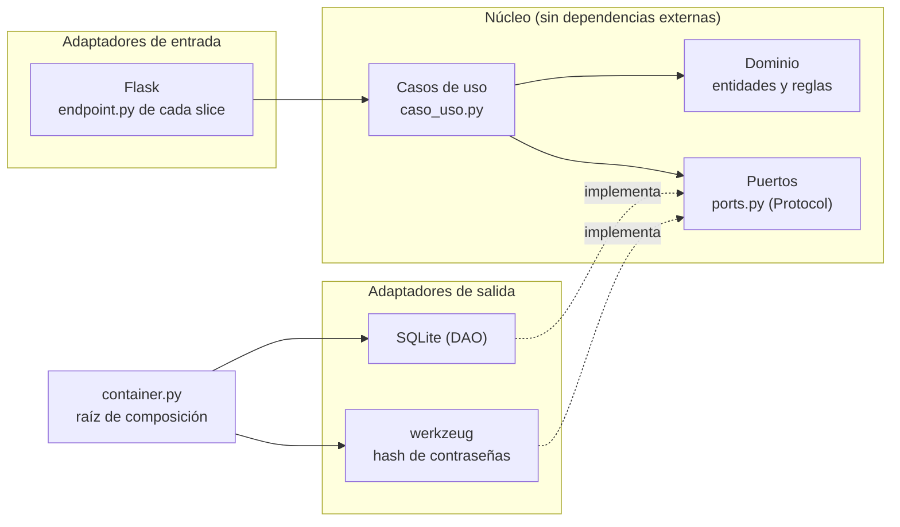
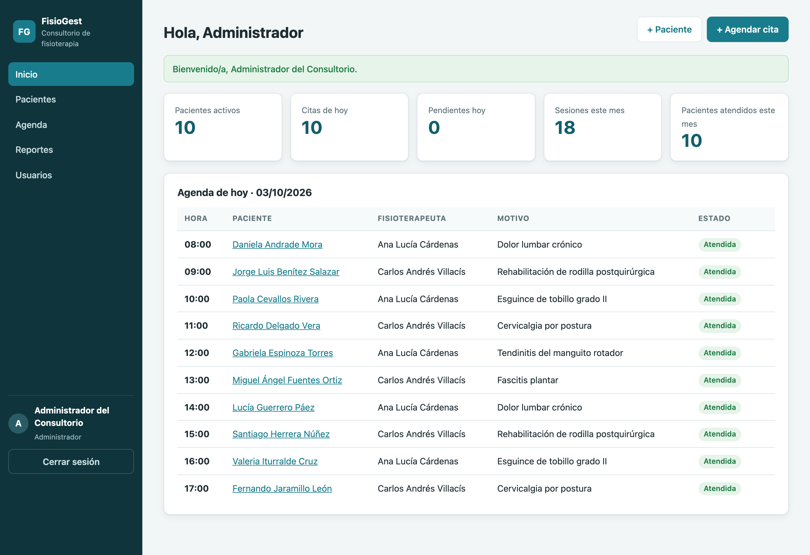
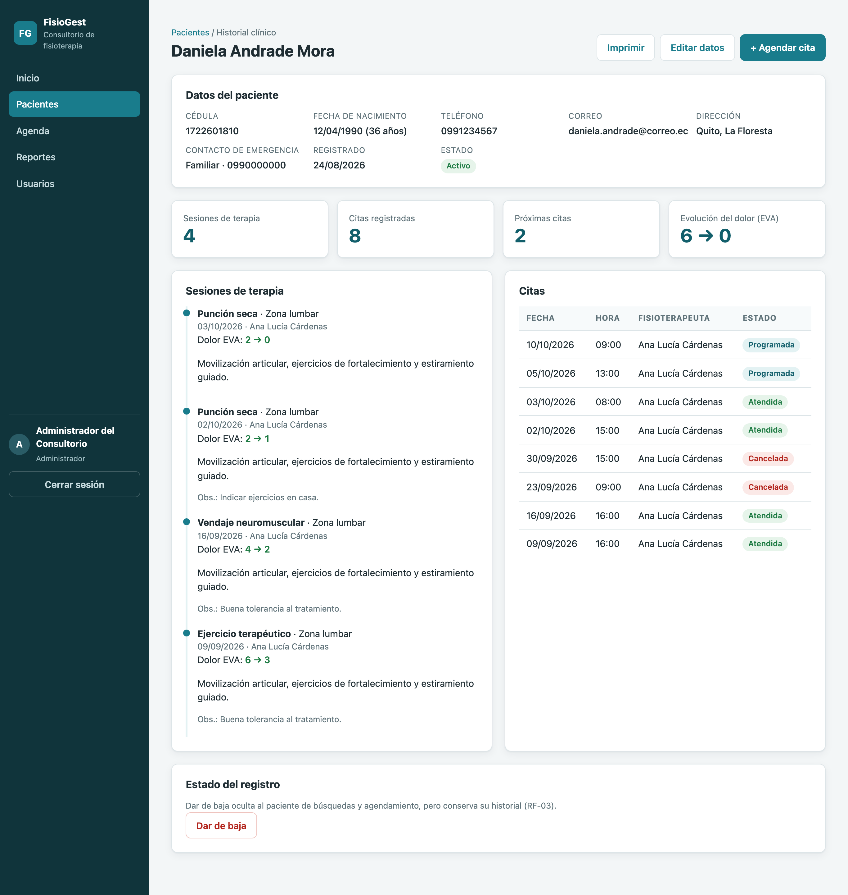
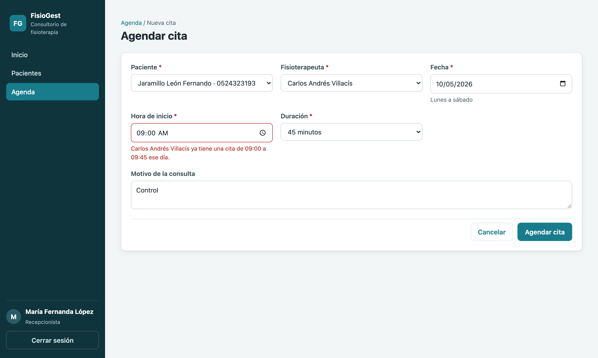
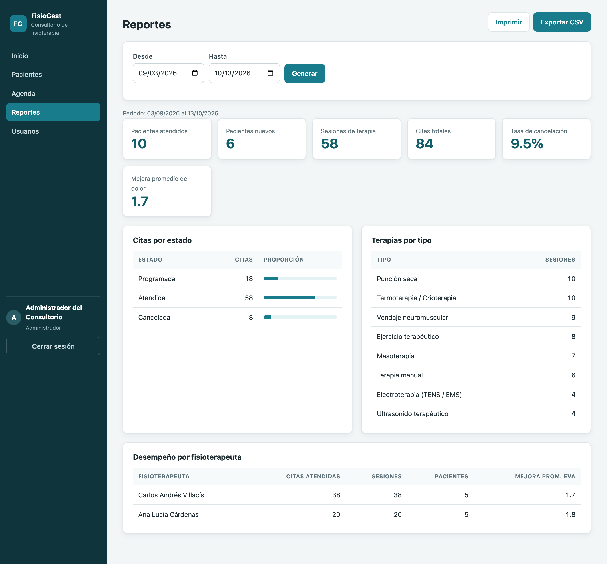

# FisioGest — Sistema de gestión para consultorio de fisioterapia

[](https://github.com/JosselynErique/fisiogest-pacientes/actions/workflows/python-app.yml)

FisioGest reemplaza los registros en papel del consultorio **FisioSalud**: centraliza pacientes,
agenda de citas, sesiones de terapia, historial clínico y reportes, con acceso por rol.

Proyecto del componente práctico-experimental de **Ingeniería de Software** — Universidad Estatal Amazónica.

| Integrantes |
|---|
| Luis Santiago Taco Batson |
| Josselyn Sofia Erique Robayo |

---

## Funcionalidades (trazabilidad con el SRS)

| Código | Requerimiento | Implementación |
|---|---|---|
| RF-01 | Registrar pacientes | `pacientes/features/registrar_paciente` (valida cédula ecuatoriana, duplicados) |
| RF-02 | Modificar pacientes | `pacientes/features/actualizar_paciente` |
| RF-03 | Eliminar (dar de baja) pacientes | `pacientes/features/dar_de_baja_paciente` (baja lógica, conserva historial) |
| RF-04 | Agendar citas con fecha, hora y fisioterapeuta | `citas/features/agendar_cita` |
| RF-05 | Evitar dos citas del mismo profesional en el mismo horario | `Cita.se_solapa_con` + `AgendarCita` |
| RF-06 | Registrar terapias y observaciones | `terapias/features/registrar_terapia` (dolor EVA 0-10) |
| RF-07 | Consultar historial clínico | `historial/features/consultar_historial` |
| RF-08 | Reportes de pacientes, citas y terapias | `reportes/features/generar_reporte` + exportación CSV |
| RF-09 | Inicio de sesión por rol | `usuarios/features/iniciar_sesion` + `requiere_rol` |
| RF-10 | Cancelar citas | `citas/features/cancelar_cita` |
| RNF-01 | Respuesta < 3 s | Consultas indexadas en SQLite; las 150 pruebas corren en ~6 s |
| RNF-02 | Acceso con usuario y contraseña | Contraseñas cifradas, bloqueo tras 5 intentos, CSRF, cabeceras seguras |
| RNF-03 | Datos disponibles y protegidos | SQLite transaccional, claves foráneas, baja lógica, volumen Docker |
| RNF-04 | Interfaz sencilla | Interfaz web responsiva, mensajes claros y validación por campo |

### Roles

| Rol | Puede |
|---|---|
| **Administrador** | Todo, además de gestionar usuarios y ver reportes |
| **Recepcionista** | Registrar/editar/dar de baja pacientes, agendar y cancelar citas |
| **Fisioterapeuta** | Ver su agenda, atender citas (registrar sesiones) y consultar historiales |

---

## Arquitectura: hexagonal + vertical slicing



- **Hexagonal (puertos y adaptadores):** el dominio y los casos de uso solo dependen de *puertos*
  (`typing.Protocol`). SQLite, werkzeug y Flask son adaptadores intercambiables que se conectan en
  `container.py`. Las pruebas unitarias reemplazan SQLite por repositorios en memoria
  (`tests/fakes.py`).
- **Vertical slicing:** cada funcionalidad es una carpeta autocontenida con su caso de uso, su
  endpoint HTTP y sus plantillas. Agregar una función no obliga a tocar capas globales.
- **Patrones del diseño (Unidad 2):** *Singleton* (`Database`), *DAO / Repository* (adaptadores
  SQLite), *Inyección de dependencias* (contenedor), *Adapter* (puertos).
- La prueba `tests/unit/test_arquitectura.py` **verifica automáticamente** que el núcleo no importe
  Flask, SQLite ni adaptadores.

```text
src/fisiogest/
├── app.py                  # fábrica Flask (create_app)
├── container.py            # raíz de composición: puertos -> adaptadores
├── modulos.py              # registro de slices (blueprints)
├── shared/                 # núcleo compartido: errores, validadores, BD, capa web
├── pacientes/
│   ├── domain/             # Paciente, PacienteRepository (puerto)
│   ├── adapters/           # SqlitePacienteRepository
│   └── features/           # slices verticales
│       ├── registrar_paciente/   caso_uso.py · endpoint.py · templates/
│       ├── listar_pacientes/
│       ├── actualizar_paciente/
│       └── dar_de_baja_paciente/
├── citas/        agendar_cita · consultar_agenda · cancelar_cita
├── terapias/     registrar_terapia
├── historial/    consultar_historial
├── reportes/     generar_reporte · exportar_reporte
├── usuarios/     iniciar_sesion · registrar_usuario · listar_usuarios · cambiar_estado_usuario
└── panel/        ver_panel
```

Más detalle en [`docs/arquitectura.md`](docs/arquitectura.md).

---

## Cómo ejecutarlo en local

Requisitos: **Python 3.10 o superior** y Git. Solo hay una dependencia de ejecución (Flask);
la base de datos es SQLite y se crea sola.

### Opción A — Python (recomendada)

**macOS / Linux**

```bash
git clone https://github.com/JosselynErique/fisiogest-pacientes.git
cd fisiogest-pacientes
python3 -m venv .venv
source .venv/bin/activate
pip install -r requirements.txt
python run.py
```

**Windows (PowerShell)**

```powershell
git clone https://github.com/JosselynErique/fisiogest-pacientes.git
cd fisiogest-pacientes
py -m venv .venv
.venv\Scripts\Activate.ps1
pip install -r requirements.txt
python run.py
```

Abre **http://localhost:5000**. En el primer arranque se crea `instance/fisiogest.db` con datos de
demostración (10 pacientes ficticios, citas y sesiones de las últimas semanas).

### Opción B — Docker

```bash
docker compose up --build
```

Disponible en **http://localhost:5000**. Los datos persisten en el volumen `fisiogest-datos`.

### Usuarios de demostración

Contraseña para todos: `Fisio2026`

| Usuario | Rol |
|---|---|
| `admin` | Administrador |
| `recepcion` | Recepcionista |
| `fisio.ana` | Fisioterapeuta |
| `fisio.carlos` | Fisioterapeuta |

> Las cédulas de los pacientes de demostración son sintéticas (válidas según el algoritmo, pero
> ficticias). Para reiniciar los datos, borra la carpeta `instance/`.

### Configuración (opcional)

Copia `.env.example` como `.env` para cambiar la clave de sesión, la ruta de la base de datos, el
puerto o desactivar los datos de demostración (`FISIOGEST_DEMO=0`; en ese caso se crea solo el
usuario `admin` con la contraseña de `FISIOGEST_ADMIN_PASSWORD`, o una temporal que se muestra en
consola).

---

## Pruebas y calidad

```bash
pip install -r requirements-dev.txt
pytest                       # 150 pruebas
pytest -m unit               # dominio, casos de uso y arquitectura
pytest -m integration        # SQLite + HTTP
pytest -m acceptance         # flujo completo CP-06
pytest --cov                 # cobertura (~89 %)
ruff check . && ruff format --check .
```

| Nivel | Qué valida | Casos del plan de pruebas |
|---|---|---|
| Unitario | Validación de cédula, reglas de citas (horario, solapamiento), bloqueo de cuenta, casos de uso con repositorios en memoria | CP-01, CP-02, CP-03 |
| Integración | Repositorios SQLite reales y endpoints Flask (registro, búsqueda, permisos, CSRF) | CP-04, CP-05 |
| Aceptación | Recepción registra y agenda → fisioterapeuta atiende → historial → reporte del administrador | CP-06 |

### Integración continua

El workflow [`.github/workflows/python-app.yml`](.github/workflows/python-app.yml) se ejecuta en
cada push y pull request:

1. **Análisis estático** con ruff (estilo y errores comunes).
2. **Pruebas por nivel** en Python 3.10, 3.11 y 3.12, con cobertura mínima del 80 %.
3. **Construcción de la imagen Docker** y verificación del endpoint `/salud`.

---

## Flujo de trabajo Git

- `main`: versión estable entregable.
- `develop`: integración de funcionalidades.
- `feature/*`: ramas de trabajo que se integran por Pull Request.

## Documentación

- [Arquitectura y diagramas UML](docs/arquitectura.md)
- [Evaluación de calidad ISO/IEC 25010](docs/calidad-iso25010.md)
- [Plan del proyecto y gestión ágil](docs/plan-proyecto.md)
- [Tablero Kanban en GitHub Projects](https://github.com/users/ls-tacob/projects/1/views/1?layout=board)

## Capturas

| Panel del administrador | Historial clínico |
|---|---|
|  |  |
| **Validación de cruce de horario (RF-05)** | **Reportes (RF-08)** |
|  |  |
