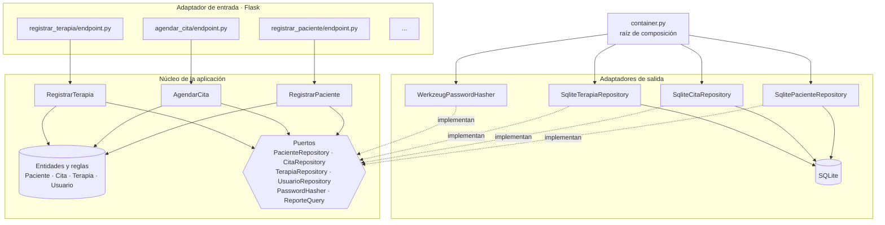
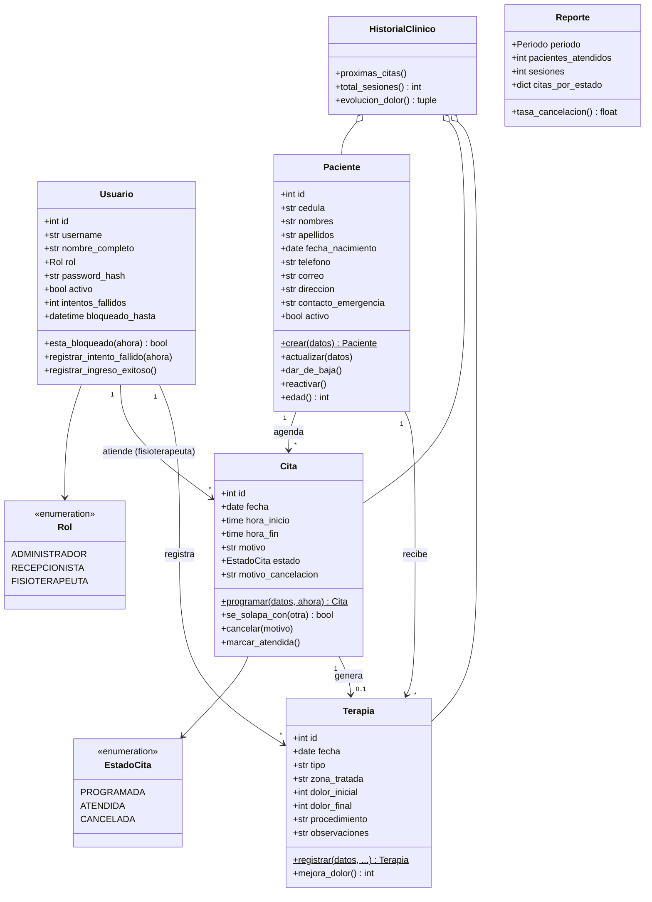
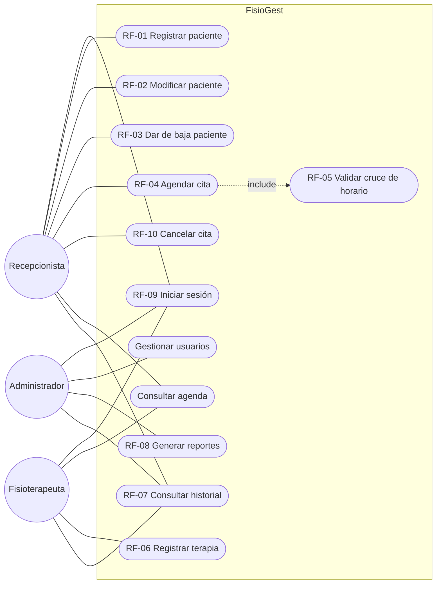
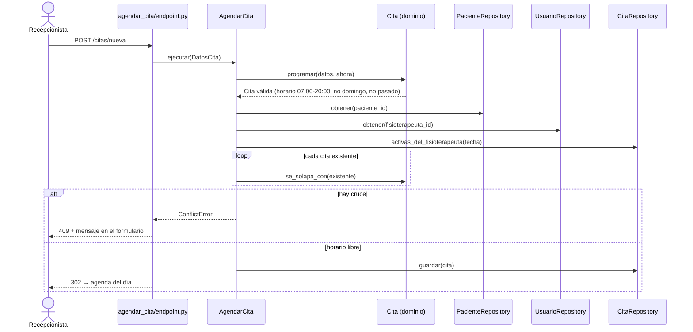
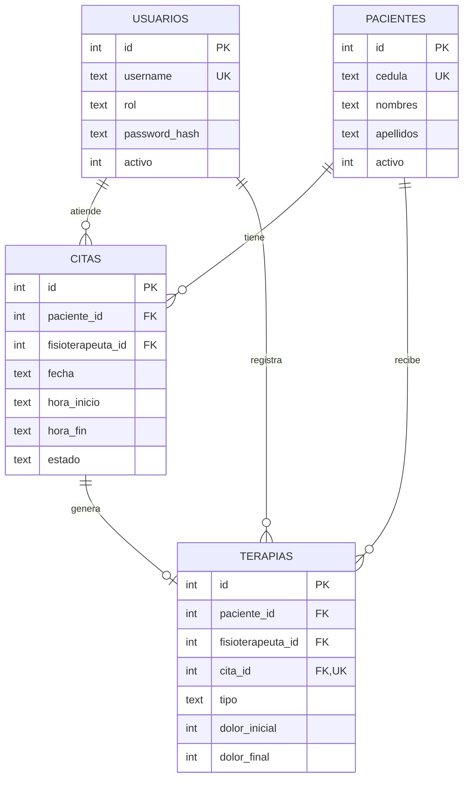

# Arquitectura de FisioGest

## 1. Decisión: de MVC a hexagonal + vertical slicing

En la Unidad 2 se propuso **MVC** con los patrones **Singleton** y **DAO**. Al implementar el sistema
completo se evolucionó a una **arquitectura hexagonal (puertos y adaptadores) organizada en slices
verticales**, sin perder lo diseñado:

| Diseño U2 | Implementación final | Dónde |
|---|---|---|
| Modelo | Entidades de dominio con sus reglas (`Paciente`, `Cita`, `Terapia`, `Usuario`) | `*/domain/*.py` |
| Controlador | Casos de uso (uno por funcionalidad) + endpoints Flask delgados | `*/features/*/caso_uso.py`, `endpoint.py` |
| Vista | Plantillas Jinja dentro de cada slice | `*/features/*/templates/` |
| DAO | Adaptadores SQLite que implementan los puertos (`PacienteRepository`…) | `*/adapters/sqlite_*.py` |
| Singleton | `Database`: una instancia por archivo de base de datos | `shared/infrastructure/database.py` |

**Por qué el cambio:** con 10 RF y 3 roles, un MVC por capas mezclaba reglas de negocio con Flask y
SQL. La arquitectura hexagonal deja el núcleo independiente y verificable sin base de datos (las pruebas
unitarias usan repositorios en memoria). El *vertical slicing* agrupa por funcionalidad, así que un
RF vive en una carpeta y agregar uno nuevo no obliga a tocar capas globales.

## 2. Vista de componentes

Reglas que se verifican en `tests/unit/test_arquitectura.py`:

1. `domain/` y `caso_uso.py` **no importan** Flask, werkzeug, sqlite3 ni adaptadores.
2. Los adaptadores solo se instancian en `container.py`.
3. Cada slice tiene su `endpoint.py`.

## 3. Diagrama de clases del dominio

## 4. Casos de uso por actor

## 5. Secuencia: agendar una cita (RF-04 / RF-05)

## 6. Modelo de datos

## 7. Seguridad (RNF-02)

- Contraseñas con hash y sal (`werkzeug.security`, scrypt/pbkdf2); nunca se guardan en texto plano.
- Bloqueo temporal de 10 minutos tras 5 intentos fallidos; mensaje genérico que no revela si el
  usuario existe.
- Token CSRF en todos los formularios; cookies de sesión `HttpOnly` y `SameSite=Lax`.
- Cabeceras `Content-Security-Policy`, `X-Frame-Options: DENY`, `X-Content-Type-Options`.
- Autorización por rol en cada endpoint (`@requiere_rol`), validada con pruebas de integración.
- Protección contra redirecciones abiertas en el parámetro `next` del login.
