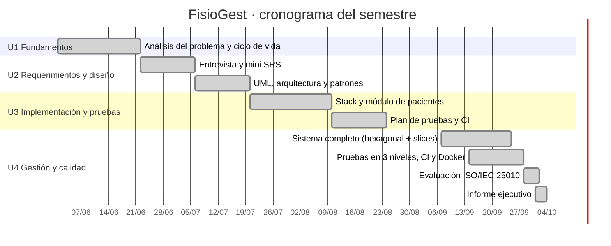

# Plan del proyecto y gestión ágil

## Metodología

Se eligió **Kanban** (Unidad 1) porque el equipo es pequeño (2 integrantes), los requisitos se
fueron refinando por unidad y se necesitaba ver de un vistazo qué estaba pendiente, en curso y
terminado. El tablero se gestionó en **Jira** (proyecto `FG`) con las columnas:

`Por hacer` → `En curso` → `En revisión (PR + CI)` → `Listo`

**Políticas del tablero**

- Límite WIP de 2 tarjetas en *En curso* por integrante.
- Una tarjeta pasa a *En revisión* solo con Pull Request abierto y pipeline en verde.
- *Definición de terminado*: código integrado en `develop`, pruebas automatizadas pasando,
  documentación actualizada.

## Cronograma

| Unidad | Semanas | Entregable | Estado |
|---|---|---|---|
| U1 · Fundamentos y ciclo de vida | 1–4 | Análisis del problema, principios, comparación de modelos, elección de Kanban | ✔ |
| U2 · Requerimientos y diseño | 5–8 | Entrevista, mini SRS (10 RF, 4 RNF), casos de uso, clases, arquitectura y patrones | ✔ |
| U3 · Implementación y pruebas | 9–12 | Matriz tecnológica (Flask), módulo de pacientes, repositorio Git, plan de pruebas, CI | ✔ |
| U4 · Gestión y calidad | 13–15 | Sistema completo con arquitectura hexagonal, 149 pruebas, CI/Docker, Jira, ISO/IEC 25010 | ✔ |
| Cierre | 16 | Informe ejecutivo y defensa | ✔ |

## Backlog (tarjetas del tablero Jira)

| Clave | Épica | Tarjeta | Requerimiento |
|---|---|---|---|
| FG-1 | Base técnica | Reestructurar a arquitectura hexagonal + vertical slicing | — |
| FG-2 | Usuarios | Inicio de sesión por rol con contraseñas cifradas | RF-09, RNF-02 |
| FG-3 | Usuarios | Gestión de usuarios por el administrador | RF-09 |
| FG-4 | Pacientes | Registrar paciente con validación de cédula | RF-01 |
| FG-5 | Pacientes | Buscar, editar y dar de baja pacientes | RF-02, RF-03 |
| FG-6 | Citas | Agendar cita sin cruces de horario | RF-04, RF-05 |
| FG-7 | Citas | Agenda diaria y cancelación de citas | RF-10 |
| FG-8 | Terapias | Registrar sesión de terapia (EVA) desde la cita | RF-06 |
| FG-9 | Historial | Historial clínico con evolución del dolor | RF-07 |
| FG-10 | Reportes | Reportes del periodo y exportación CSV | RF-08 |
| FG-11 | Calidad | Pruebas en 3 niveles + prueba de arquitectura | — |
| FG-12 | Calidad | Pipeline CI (ruff, pytest 3.10–3.12, cobertura, Docker) | — |
| FG-13 | Calidad | Evaluación ISO/IEC 25010 | — |
| FG-14 | Cierre | Informe ejecutivo del componente práctico | — |
